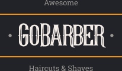

<h1 align="center">
    
     
</h1>
dd

<h4 align="center">
  A mobile application made with React Native & TypeScript built for beauty service providers.
</h4>

  
  
    
## :rocket: Technologies

This project was developed at the [RocketSeat GoStack Bootcamp](https://rocketseat.com.br/bootcamp) with the following technologies:

-  [ReactJS](https://reactjs.org/)
-  [babel-plugin-root-import](https://github.com/entwicklerstube/babel-plugin-root-import)
-  [react-navigation](https://reactnavigation.org/)
-  [react-native-gesture-handler](https://github.com/kmagiera/react-native-gesture-handler)
-  [Redux](https://redux.js.org/)
-  [Redux-Saga](https://redux-saga.js.org/)
-  [redux-persist](https://github.com/rt2zz/redux-persist)
-  [styled-components](https://www.styled-components.com/)
-  [Axios](https://github.com/axios/axios)
-  [Immer](https://github.com/immerjs/immer)
-  [date-fns](https://date-fns.org/)
-  [react-native-linear-gradient](https://github.com/react-native-community/react-native-linear-gradient)
-  [react-native-vector-icons](https://github.com/oblador/react-native-vector-icons)
-  [react-native-vector-icons](https://github.com/oblador/react-native-vector-icons)
-  [Reactotron](https://infinite.red/reactotron)
-  [reactotron-redux](https://github.com/infinitered/reactotron-redux)
-  [reactotron-redux-saga](https://github.com/infinitered/reactotron-redux-sagan)
-  [VS Code][vc] with [EditorConfig][vceditconfig] and [ESLint][vceslint]

 
 

[nodejs]: https://nodejs.org/
[yarn]: https://yarnpkg.com/
[vc]: https://code.visualstudio.com/
[vceditconfig]: https://marketplace.visualstudio.com/items?itemName=EditorConfig.EditorConfig
[vceslint]: https://marketplace.visualstudio.com/items?itemName=dbaeumer.vscode-eslint
